(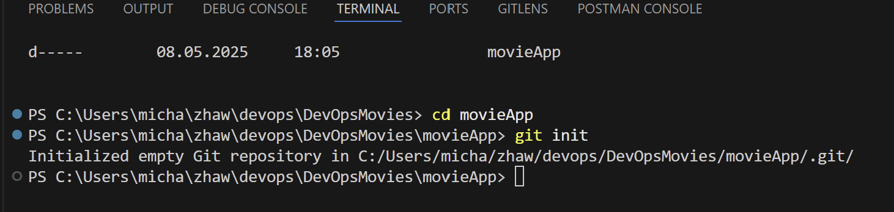)

(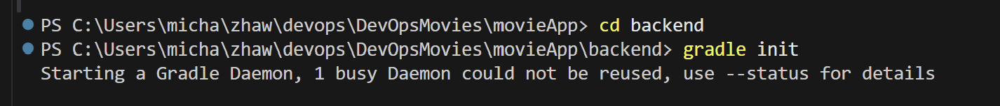)

(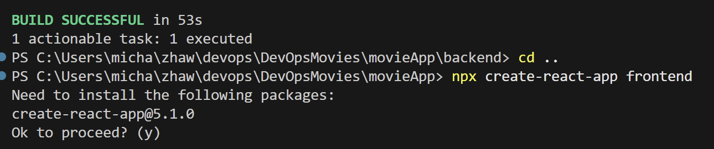)

(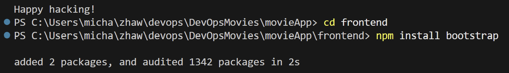)

Dannach habe ich Springboot als Plugin und als den Springboot Starter ind die Dependency hinzugefügt:

dannach Mal das Backend gestartet mit ./gradlew bootRun. und einen simplen Rootcontroller erstellt.
(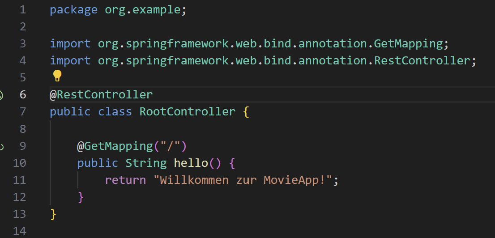)

(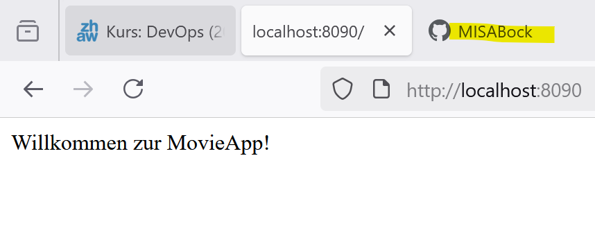)

desweiteren habe ich die App.js Datei angepasst. () und das frontend gestartet

(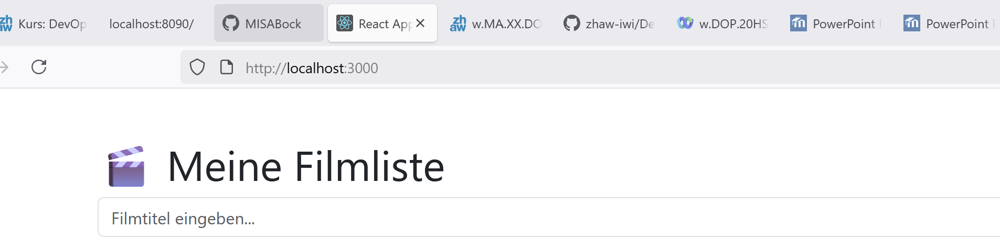)
<video controls src="videos/ControllerWorking.mp4" title="Frontend Demonstration"></video>

Alles funktioniert wie geplant. Hier noch die Erklärung zu den einzelnen Backend Komponenten.

MovieController:

Dieser Code speichert Filme in einer Liste. Man kann Filme abrufen (GET), hinzufügen (POST) und löschen (DELETE), wobei jeder Film automatisch eine ID bekommt.

(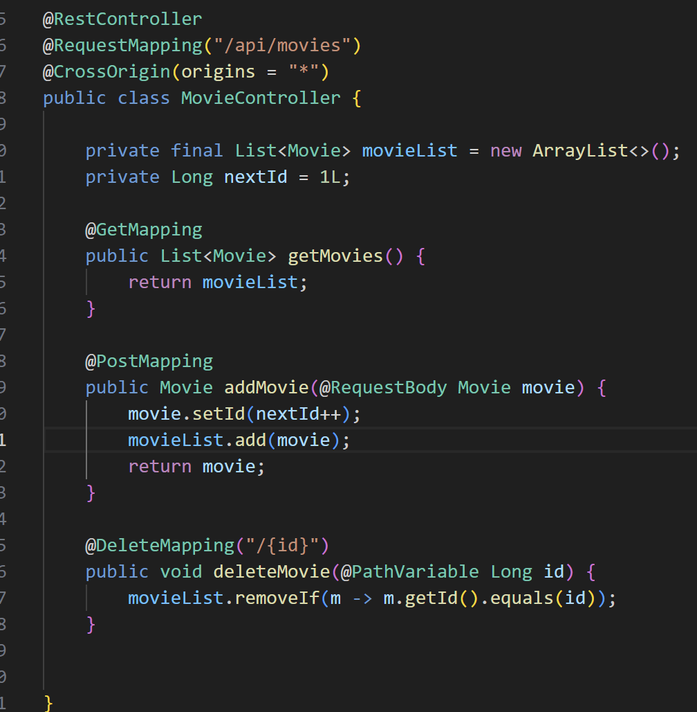)

Movie:

in dieser Klasse wird ein Objekt Movie erstellt mit den Attributen ID und Titel

(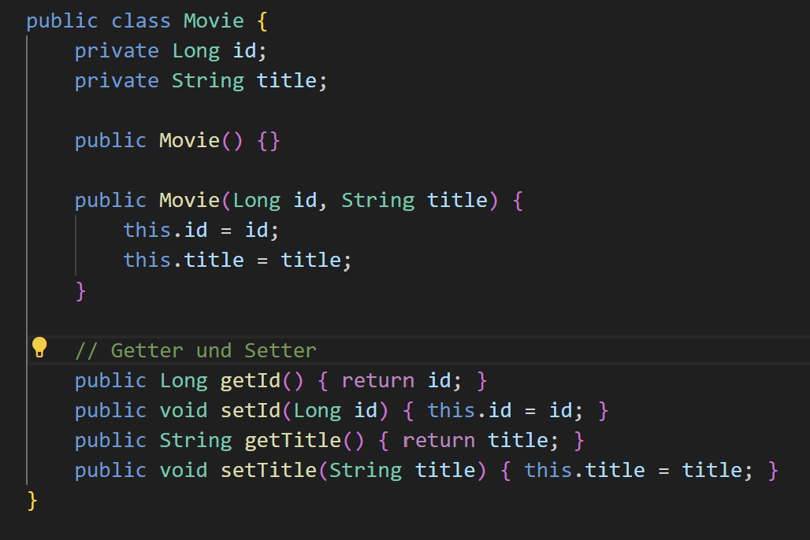)

Containers

Um das backend in einem Container laufen zu lassen, habe ich zuerst die Datei docker-compose.yaml und ein Dockerfile erstellt.

- [Dockerfile](Dockerfile): Damit habe ich das Docker-Image erstellt mir meiner Env und Conf.
- [docker-compose](docker-compose.yaml): Damit die Container und deren Beziehung zu einander definiert. Sql & movieApp

damit die Filme auch persistiert werden können, habe ich mich entschieden auch einen sql Container zu erstellen.
(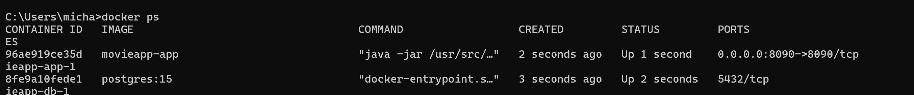)

Ich habe die App noch so erweitetert, dass ich die DB, die Movie Liste, auch befüllen kann. Hier eine kuzre Demo mit Postman.

zuerst die leere Liste
(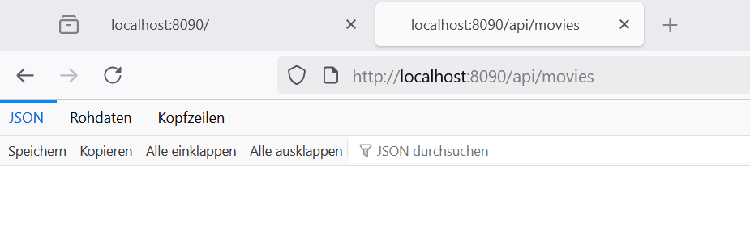)

Hier übergebe ich den Film an die Liste: Film bockmic1
(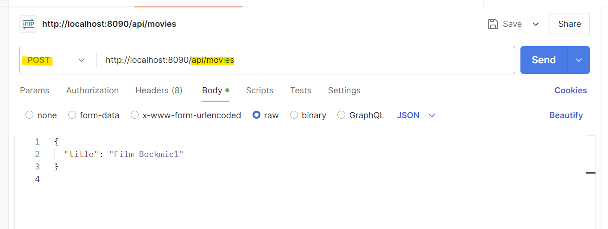)

Hier das Resulat:
(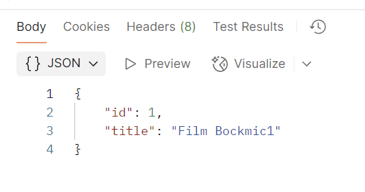)
(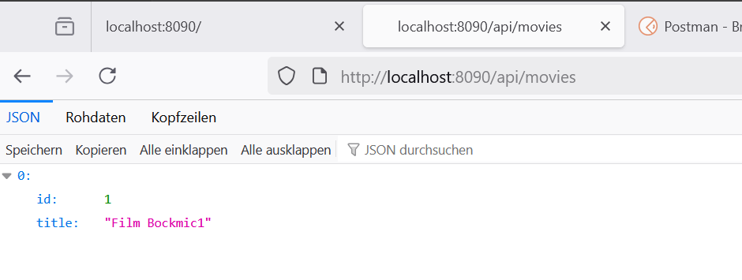)

