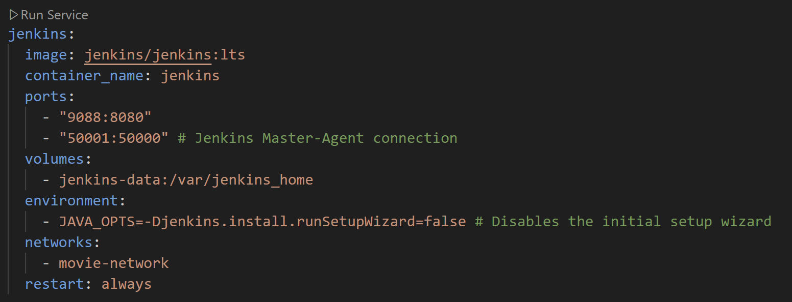

()

()

()

()

Dannach habe ich Springboot als Plugin und als den Springboot Starter ind die Dependency hinzugefügt:

dannach Mal das Backend gestartet mit ./gradlew bootRun. und einen simplen Rootcontroller erstellt.
()

()

desweiteren habe ich die App.js Datei angepasst. () und das frontend gestartet

()
<video controls src="videos/ControllerWorking.mp4" title="Frontend Demonstration"></video>

Alles funktioniert wie geplant. Hier noch die Erklärung zu den einzelnen Backend Komponenten.

MovieController:

Dieser Code speichert Filme in einer Liste. Man kann Filme abrufen (GET), hinzufügen (POST) und löschen (DELETE), wobei jeder Film automatisch eine ID bekommt.

()

Movie:

in dieser Klasse wird ein Objekt Movie erstellt mit den Attributen ID und Titel

()

Containers

Um das backend in einem Container laufen zu lassen, habe ich zuerst die Datei docker-compose.yaml und ein Dockerfile erstellt.

- [Dockerfile](Dockerfile): Damit habe ich das Docker-Image erstellt mir meiner Env und Conf.
- [docker-compose](docker-compose.yaml): Damit die Container und deren Beziehung zu einander definiert. Sql & movieApp

damit die Filme auch persistiert werden können, habe ich mich entschieden auch einen sql Container zu erstellen.
()

Ich habe die App noch so erweitetert, dass ich die DB, die Movie Liste, auch befüllen kann. Hier eine kuzre Demo mit Postman.

zuerst die leere Liste
()

Hier übergebe ich den Film an die Liste: Film bockmic1
()

Hier das Resulat:
()
()

Auf Localhost:8090 läuft das Frontend via Docker
()
()

Als nächstes habe ich Jenkins in meinem Dockerfile hinzugefügt um Jenkins über einen Docker Container auf localhost:9088 laufen zu lassen.
()
()
GithubToken

Als nächstes habe ich einen neuen Freestyle-Job erstellt, konfiguriert und Jenkins Plugins installiert .
()
()

NodeJS hinzugefügt
()
()

Als nächstes habe ich Junit Test und JaCoCo Reports im Jenkins integriert:
()
()
()

Hier noch SonarQube im Container
()
()

Als nächstes habe ich die Pipeline erstellt und kofiguriert damit der Build über das Jenkinsfile auf Jenkins automatisch abläuft. Via Github-Repo
[PipelineConfig](Logs/PipelineConfig.txt)
[PipelineLogs](Logs/PipelineLogs.txt)

Damit das ganze Projekt auf Container über Jenkins läuft, habe ich ein neues Freestyle-Projekt erstellt und das Docker Build Plugin hinzugefügt.
[DockerBuildPlugin](images/DockerBuildPlugin.png)
[dockerBuildJob](images/dockerBuildJob.png)
[CloudNodeJenkins](images/CloudNodeJenkins.png)
[2375Check](images/2375Check.png)

Die Jobs laufen jetzt über Cloud Container "Docker Jenkins" und nicht über den Master Node
[RunnbingOnDockerAgent](images/RunnbingOnDockerAgent.png)

Als nächstes habe ich das Projekt so konfiguriert, dass es ein Image von meinem Dockerfile im movieApp-Projekt erstellt.
[DockerImageLogs](Logs/DockerImageLogs.txt)
[movieAppImageLocal](images/movieAppImageLocal.png)
[CreatingImageOnJenkins](images/CreatingImageOnJenkins.png)

Als nächstes habe ich das moveAppDockerDeploy-Projekt gestartet damit Jenkins-Build immer Container aus dem  Image startet. 
Dabei habe ich definiert, dass beim Build jedesmal der alte Container zuerst entfernt wird.
[DockerDeployProject](images/DockerDeployProject.png)

Dannach soll direkt ein neuer Container gebaut werden. Im gleichen Netzwerk und definiertem Port-Binding
[createNewContainer](images/createNewContainer.png)
[StartDockerContainerMovieApp](images/StartDockerContainerMovieApp.png)

Danach habe ich noch den Build des gesamt Projektes so definiert, dass der Prozess immer direkt nach dem movieAppDockerBuild getriggered werden soll.
[BuildingDockerBuild](images/BuildingDockerBuild.png)
[TriggeredByBuildProcess](images/TriggeredByBuildProcess.png)

Als nächstes habe ich einen Access Token auf Docker Hub kreiirt, damit ich das Docker Image auf Docker-Hub uploaden kann. Dann auf Jenkins unter Credentials den Token hinzugefügt.
[DockerhubToken](images/DockerhubToken.png)
[dockerHubTokenToJenkins](images/dockerHubTokenToJenkins.png)

Hier sieht man wie das Image auf DockerHub erfolgreich gepushed wurde
[ImagePushedToDockerHub](Logs/ImagePushedToDockerHub.txt)
[DockerHubPush](images/DockerHubPush.png)

Als nächstes habe habe ich mich auf Render.com angemeldet, einen neuen Web-Service eröffnet und mein Docker Image angegeben und verbunden.
[RenderDeployingFromImage](images/RenderDeployingFromImage.png)

den Render-Token kopiert und als Credential in Jenkins erstellt:
[RednerSecretIntoJenkins](images/RednerSecretIntoJenkins.png)

